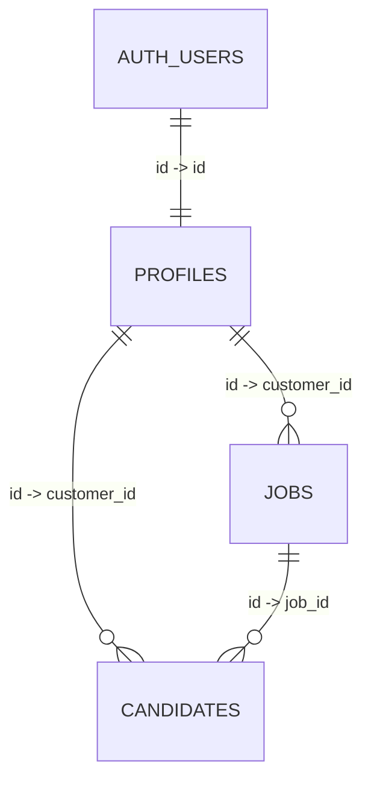

# Mini ATS – Deterministic Demo Dataset

This directory contains canonical seed data for demonstrating and testing the Mini ATS prototype.

---

## 1. Purpose of the Dataset

The canonical dataset defined in [`demo_dataset.json`](./demo_dataset.json) provides a reproducible, structured environment for:
- 5-minute screen recording demos (see [`docs/DEMO.md`](../../docs/DEMO.md)).
- Visualizing a rich, realistic Kanban board with 10 candidates distributed across all six stages.
- Validating job filtering, case-insensitive partial name searching, candidate stage drag-and-drop, and AI CV assessments.

---

## 2. Privacy & Fictionality

> [!NOTE]
> All persons, companies, emails, and URLs in this dataset are 100% fictional demo fixtures.
> - Candidate emails use the reserved `example.com` domain.
> - LinkedIn profile links are mock URLs prefixed with `https://www.linkedin.com/in/mini-ats-demo-`.

---

## 3. Entity Relationships & UUID Mapping

The dataset enforces clean multi-tenant scoping and foreign-key integrity matching [`supabase/migrations/0001_init.sql`](../migrations/0001_init.sql):



### Users & Profiles
- **Seed Admin** (`11111111-1111-4111-8111-111111111111`):
  - Email: `admin@nordic-recruit.demo`
  - Role: `admin` (System administrator who can act on behalf of any customer)
- **Elin Recruiter / Nordic Tech AB** (`22222222-2222-4222-8222-222222222222`):
  - Email: `recruiter@nordic-tech.demo`
  - Role: `customer` (The primary hiring tenant)

### Jobs (Owned by Customer `22222222-2222-4222-8222-222222222222`)
- `33333333-3333-4333-8333-333333333301`: **Senior Frontend Engineer**
- `33333333-3333-4333-8333-333333333302`: **Backend Engineer .NET**

### Candidates (All owned by Customer `22222222-2222-4222-8222-222222222222`)
- 10 candidates (`55555555-5555-4555-8555-555555555501` through `...10`) mapped to either the Frontend or Backend role across all Kanban stages (`new`, `screening`, `interview`, `offer`, `hired`, `rejected`).

---

## 4. How to Use for Demo Recording

1. Ensure the demo auth accounts exist in Supabase (see [`create_demo_auth_users.md`](./create_demo_auth_users.md)).
2. Execute [`demo_data.sql`](./demo_data.sql) in your Supabase SQL Editor.
3. Sign in as Admin (`admin@nordic-recruit.demo`) or Customer (`recruiter@nordic-tech.demo`).
4. Follow the scripted flow in [`docs/DEMO.md`](../../docs/DEMO.md).

---

## 5. What If Supabase Auth User IDs Differ?

In Supabase Postgres, `public.profiles.id` is constrained by a foreign key to `auth.users(id)`:
```sql
REFERENCES auth.users(id) ON DELETE CASCADE
```

If Supabase generates random UUIDs for `admin@nordic-recruit.demo` and `recruiter@nordic-tech.demo` that differ from the canonical IDs (`11111111-...` and `22222222-...`):
1. Copy the actual UUIDs from `auth.users` via Supabase Dashboard or `SELECT id, email FROM auth.users;`.
2. Update the corresponding UUIDs in:
   - `supabase/seed/demo_data.sql`
   - `supabase/seed/demo_dataset.json`
   - `docs/DEMO.md`
3. [`demo_data.sql`](./demo_data.sql) will check `auth.users` before inserting profiles and will produce a descriptive error if the referenced UUIDs are not found.
